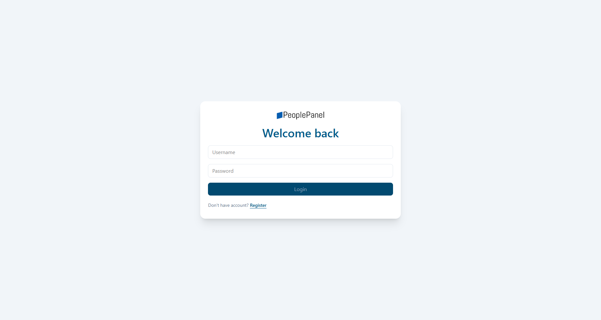
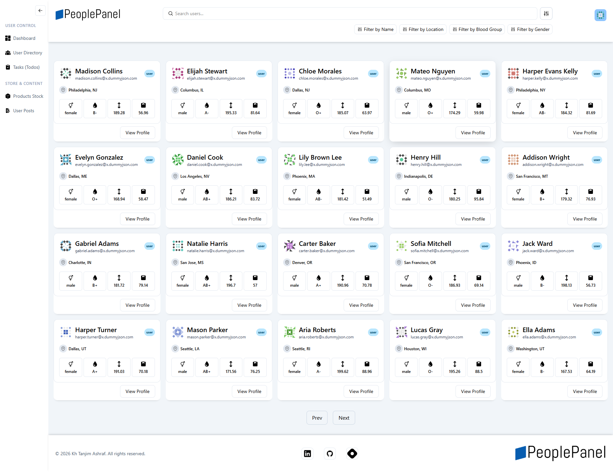

# JWT Authentication Dashboard with DummyJSON API

A frontend React project that demonstrates a secure authentication flow with JWT-based login, protected routing, and a user dashboard powered by the DummyJSON API. The application is designed to simulate a real-world admin or user management interface where users authenticate before they can access a dashboard containing user directory data.

## Scenario

This project presents a common business scenario in modern web applications: a user must sign in before viewing protected application data. The app starts from a guest/authentication screen where the user can either log in or register. Once valid credentials are provided, the application stores JWT tokens in local storage, redirects the user to the dashboard, and fetches user details and user listings from the DummyJSON API.

The dashboard is structured like a data-heavy admin panel with a header, side navigation, search/filter controls, and a user-card-based layout. It showcases how React can be used to build a complete authentication experience, while still integrating with external APIs for real data.

The use case is aligned with a realistic team dashboard or user-management portal where:

- Users authenticate before accessing sensitive information
- Protected routes block unauthenticated visitors
- User profiles are loaded after successful login
- Dashboard content is fetched dynamically from an external API
- Search and filtering UI improves usability for browsing data

## Screenshots

Below is reserved space for your project screenshots. You can replace this section with your own captured previews of the login page, register page, dashboard, and user card layout.

<div style="border: 2px dashed #94a3b8; border-radius: 12px; padding: 2rem; margin: 1.5rem 0; background-color: #0e131f; color: #475569; min-height: 260px; display: flex; align-items: center; justify-content: center; flex-direction: column; gap: 5px;">
  <strong style="color: white; text-align: center;;">Project Screenshots</strong>

  <!-- Login Page Screenshot -->
  <div>
    <strong style="color: #8B939C">Login Page</strong>
    
  </div>

  <!-- Dashboard Screenshot -->
  <div>
    <strong style="color: #8B939C">Dashboard</strong>
    
  </div>
</div>

### Included Screenshots

- Login screen
- Registration screen
- Protected dashboard view
- User directory with cards and pagination

## Feature List

- JWT-based login using the DummyJSON authentication endpoint
- Protected route handling using token validation
- Automatic redirection for logged-in and logged-out users
- Local storage-based session persistence
- Access-token refresh flow for authentication resilience
- Dashboard layout with top header and side navigation
- User directory fetched from the DummyJSON users API
- Search input and filter button UI for browsing users
- Pagination controls for navigating large user datasets
- Responsive card-based presentation of user profiles
- Loading and error handling during API calls
- Clean modern interface built with React + Tailwind CSS

## Tech Stack

- React
- React Router DOM
- Vite
- Tailwind CSS
- DummyJSON API
- Local Storage for persistence

## Project Structure

```text
src/
├── App.jsx
├── main.jsx
├── index.css
├── component/
│   ├── card/
│   ├── filter-button/
│   ├── ui/
│   └── ...
├── contexts/
│   ├── authContext.js
│   ├── errorContext.js
│   └── loadingContext.js
├── layouts/
│   ├── AuthLayout/
│   └── GuestLayout/
├── pages/
│   ├── Login.jsx
│   ├── Register.jsx
│   └── dashboard/
├── services/
│   ├── api.client.js
│   ├── auth.service.js
│   └── user.service.js
├── utils/
│   └── auth.utils.js
└── assets/
```

## Authentication Flow

The app follows a classic JWT flow:

1. User enters username and password on the login page.
2. The frontend sends a POST request to the DummyJSON authentication endpoint.
3. The server returns access and refresh tokens.
4. Tokens are saved in local storage.
5. The app redirects to the protected dashboard route.
6. Subsequent authenticated requests include the access token in the Authorization header.
7. If the access token expires, the app refreshes the token using the refresh token.
8. If the session becomes invalid, the app clears stored tokens and redirects the user back to login.

## DummyJSON API Integration

This frontend consumes data from the DummyJSON API, including:

- Authentication endpoints: /auth/login, /auth/refresh
- User profile endpoint: /auth/me
- User listing endpoint: /users?limit=&skip=

This project demonstrates how frontend React applications can integrate with a third-party API to fetch login data, user profiles, and dashboard records while keeping the user experience seamless.

## React Concepts Used - Requirements Mapping Table

| Requirement              | React Concept Used                          | How It Is Applied in This Project                                                                    |
| ------------------------ | ------------------------------------------- | ---------------------------------------------------------------------------------------------------- |
| User authentication flow | State management + conditional rendering    | Login form updates state for username/password and shows loading/error states during authentication  |
| Protected route access   | React Router + route guards                 | Guest and authenticated layouts redirect users based on token presence                               |
| Login/register screen UI | Component-based design                      | Login and Register pages are separate reusable views inside the app structure                        |
| Dashboard experience     | Reusable UI components                      | User cards, buttons, badges, headers, and cards are composed into a dashboard interface              |
| Context-based app data   | Context API                                 | Error and loading states are shared across pages and layouts via context                             |
| API communication        | useEffect + async functions                 | Data is fetched from DummyJSON when the dashboard loads or when auth is required                     |
| Pagination               | URL search params + state-driven navigation | skip and limit values are read from the URL to control which users are displayed                     |
| Session persistence      | localStorage interaction                    | JWT tokens and user data are stored so the session remains across reloads                            |
| Dynamic UI updates       | Event handling + state updates              | Form inputs, login actions, and page navigation all trigger state changes in React                   |
| Cleaner UI organization  | Layout composition                          | AuthLayout and GuestLayout wrap different route groups for authenticated and unauthenticated screens |
| Reusable data display    | Props-driven rendering                      | User data is passed through props into a reusable UserCard component                                 |

## Setup and Run

1. Clone the project
2. Install dependencies:

```bash
npm install
```

3. Start the app in development mode:

```bash
npm run dev
```

4. Open the local development URL shown in the terminal.

## Notes

- This project is a frontend-only implementation focused on React application design and JWT-based authentication behavior.
- It is intended for learning and demonstration purposes, especially for understanding how frontend apps integrate with real API authentication and protected user dashboards.
- The design can be extended with forms validation, password-reset flow, user detail pages, product listings, and richer dashboard analytics.

## Future Enhancements

- Add secure registration form validation
- Add user profile page with full details
- Add product and posts sections matching the side navigation
- Improve search and filter logic with real filtering against API data
- Add persistent role-based access control
- Improve UX with toast notifications for login/logout events
